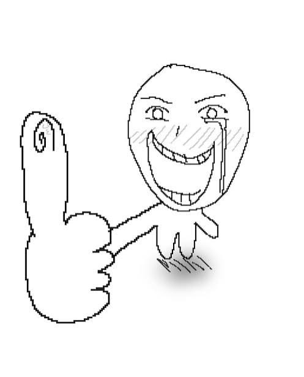

# Mon projet

 

## Table des matières

  - [Table des matières](#table-des-matières)
  - [Introduction](#introduction)
    - [Objectif](#objectif)
  - [Matériel](#matériel)
    - [Capteurs](#capteurs)

## Table des matières

  - [Introduction](#introduction)
    - [Objectif](#objectif)
  - [Matériel](#matériel)
    - [Capteurs](#capteurs)

 

## Introduction

***This should be centered***

### Objectif

 

## Matériel

 

### Capteurs

# Markdown_tool

## Project Overview
Extention markdown pour sortire du text d'un fichier autre ou lien.
## Project setup
This project is based on the mistletoe library.

<input type="checkbox"> <label>test</label> 

<input type="checkbox"> <label>test</label> 

<input type="checkbox"> <label>test</label> 

<ul><li>6_code_OUT.md</li><li>Cahier_charges_Projet_1_JR.docx</li><li>Centered_file.md</li><li>Exemple.html</li><li>Exemple.md</li><li>Final.md</li><li>highlighter.py</li><li>mistletoe_imgext.py</li><li>output.html</li><li>Product_Backlog.md</li><li>projet_1_markdown.md</li><li>projet_1_markdown.md.html</li><li>README.md</li><li>Schéma concept projet 1.drawio</li><li>Schéma concept projet 1.drawio.png</li><li>Sprint_Backlog.md</li><li>style.css</li><li>testimages</li><li>Untitled-1.py</li><li>__pycache__</li></ul>

## we are in the
- a
    - d

## This is the end

## TEXT EXAMPLE
hjfdskjfasdjlkasfdjlkjlk;fdfdas
fdsa
fasd
fsda
fsd
fds
dfa
sasdf
fdas

## 1. Test des couleurs simples

{{red|Texte rouge}}

{{blue|Texte bleu}}

{{green|Texte vert}}

{{purple|Texte mauve}}